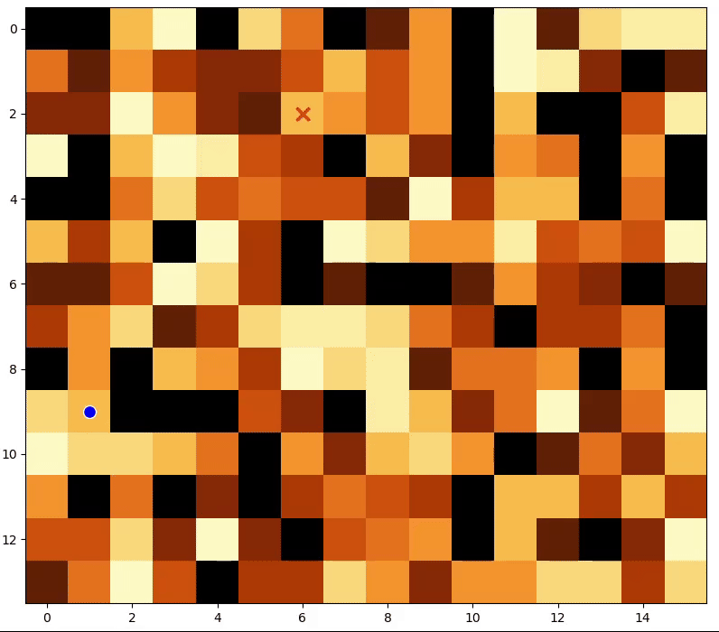
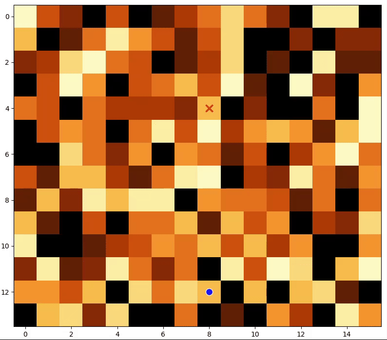
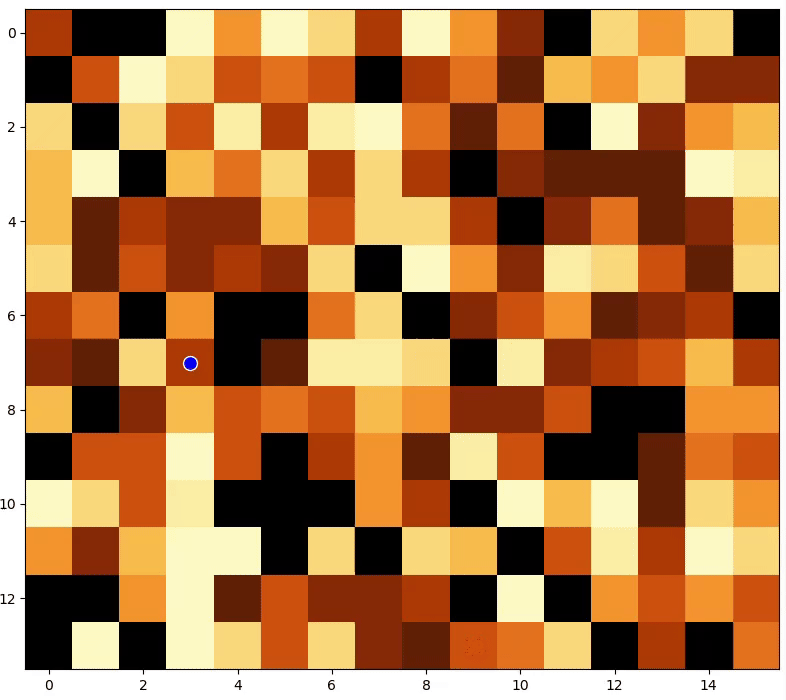

# Maze Solver

This project implements various pathfinding algorithms to solve mazes. It includes a maze generator, different search algorithms, and a visualizer to display the maze-solving process.

## Features

- Maze generation with customizable dimensions and obstacle density
- Multiple pathfinding algorithms:
  - Breadth-First Search (BFS)
  - Dijkstra's Algorithm
  - A* Search
- Step-by-step visualization of the search process
- Configurable settings for maze size, algorithm selection, and visualization parameters


| Breadth-First Search (BFS) | Dijkstra's Algorithm | A* Search |
|:--------------------------:|:--------------------:|:---------:|
|  |  |  |

## Getting Started

1. Make selection of searcher type in `config.py`

2. Run the maze solver (tested on Python 3.8):
   ```
   python3 run.py
   ```

## Configuration

You can modify the `config.py` file to adjust various settings:

- `SEARCHER_TYPE`: Choose the pathfinding algorithm ("bfs", "dijkstra", or "a_star")
- `MAZE_HEIGHT` and `MAZE_WIDTH`: Set the dimensions of the maze
- `CELL_SIZE`: Adjust the size of each cell in the visualization
- `DELAY`: Set the delay between steps in the visualization
- `OBSTACLE_DENSITY`: Change the percentage of cells that are obstacles
- `IS_SHOW_COST`: Toggle the display of path costs


